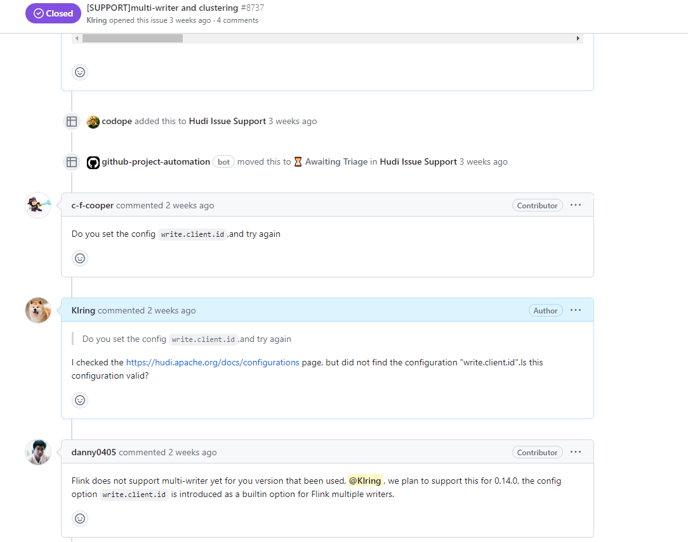

# Hudi合并小文件方案

#### 1.背景

使用flink写入日志数据时，使用“insert”模式和“COPY_ON_WRITE”写入Hudi时，会更加“write.tasks”参数配置的个数，产生小文件，按照写入配置1分钟写入一次“write.tasks”=8，一天会产生11520个文件，严重影响了表的查询速度。

#### 2.解决方案

Hudi0.13版本发布了flink写入Hudi异步合并小文件的功能，配置如下：

```
'clustering.schedule.enabled'='true' ,
'clustering.async.enabled'='true' ,
'clustering.plan.partition.filter.mode'= 'RECENT_DAYS' ,
'clustering.plan.strategy.daybased.lookback.partitions'='1' ,
'hoodie.clustering.plan.strategy.small.file.limit'='629145600',
'hoodie.clustering.plan.strategy.target.file.max.bytes'='1073741824',
'clustering.delta_commits' = '15'
```

通过'clustering.schedule.enabled'='true' ,'clustering.async.enabled'='true' ,开启异步创建合并计划和执行计划，clustering.plan.partition.filter.mode和clustering.plan.strategy.daybased.lookback.partitions参数设置仅合并当天的分区文件，'hoodie.clustering.plan.strategy.small.file.limit'配置小文件为600M，当文件小于600M就会被创建到合并计划里，'hoodie.clustering.plan.strategy.target.file.max.bytes'参数设置为合并后最大文件大小为1GB，'clustering.delta_commits'设置15次提交合并一次。

通过以上配置可以完成单表写入并进行小文件合并，但是当多写（flink消费kafka、flink消费sls）同一个表时，会发生报错，像Hudi提交了issue，官方告知此BUG将由0.14版本进行修复。


所以，目前合并小文件方案为单表写入+在线合并。