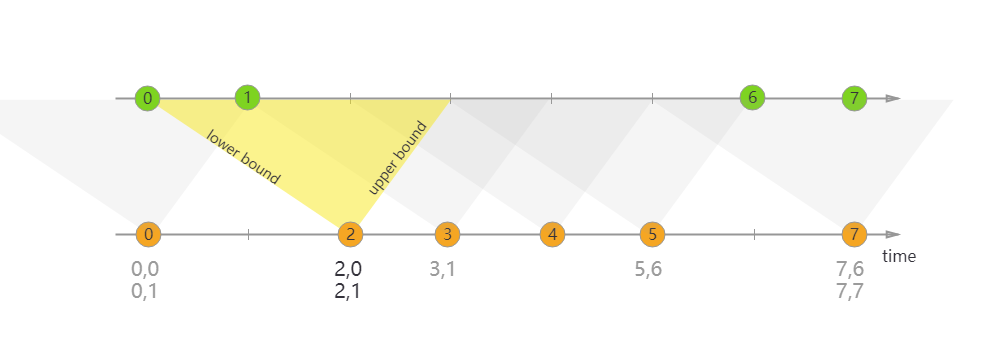

# Flink

## 表定义
动态表(dynamic table)：动态表是流的另一种表达方式，动态表作为一个逻辑的抽象概念，使我们更容易理解flink中将streaming发展到table这个层次的设计，本质都是对无边界、持续变更数据的表示形式，所以动态表与流之间可以相互转换。
Append-only 流： 仅通过 INSERT 操作修改的动态表可以通过输出插入的行转换为流。  

Retract 流： retract 流包含两种类型的 message： add messages 和 retract messages 。通过将INSERT 操作编码为 add message、将 DELETE 操作编码为 retract message、将 UPDATE 操作编码为更新(先前)行的 retract message 和更新(新)行的 add message，将动态表转换为 retract 流

Upsert 流: upsert 流包含两种类型的 message： upsert messages 和delete messages。转换为 upsert 流的动态表需要(可能是组合的)唯一键。通过将 INSERT 和 UPDATE 操作编码为 upsert message，将 DELETE 操作编码为 delete message ，将具有唯一键的动态表转换为流。消费流的算子需要知道唯一键的属性，以便正确地应用 message。与 retract 流的主要区别在于 UPDATE 操作是用单个 message 编码的，因此效率更高。

时态表(temporal table)：是一张随时间变化的表, 在 Flink 中称为动态表，时态表中的每条记录都关联了一个或多个时间段，所有的 Flink 表都是时态的（动态的）。也就是说时态表是动态表的特例，时态表一定是动态表，动态表不一定是时态表。

时态表可以分为 版本表 和 普通表。
版本表: 如果时态表中的记录可以追踪和并访问它的历史版本，这种表我们称之为版本表，来自数据库的 changelog 可以定义成版本表。

普通表: 如果时态表中的记录仅仅可以追踪并和它的最新版本，这种表我们称之为普通表，来自数据库 或 HBase 的表可以定义成普通表。  
Flink 中，定义了主键约束和事件时间属性的表就是版本表。

## JOIN
### Regular Joins
常规 JOIN（Regular JOIN）是语法最简单的一类 JOIN，和传统数据库的 JOIN 语法完全一致。对于左表和右表的任何变动，都会触发实时计算和更新，因此它的结果是“逐步逼近”最终的精确值，也就是下游可能看到变来变去的结果。为了支持结果的更新，下游目的表需要 定义主键 （PRIMARY KEY NOT ENFORCED）。  
不支持时间窗口以及时间属性，任何一侧数据流有更改都是可见的，直接影响整个 join 结果。如果有一侧数据流增加一个新纪录，那么它将会把另一侧的所有的过去和将来的数据合并在一起，因为regular join 没有剔除策略，这就影响最新输出的结果; 正因为历史数据不会被清理，所以 regular join 支持数据流的任何更新操作（插入、更新、删除）。  
这种 JOIN 要求 JOIN 两边数据都永久保留在 Flink state 中，才能保证输出结果的准确性，这将导致 State 的无限膨胀。  
可以配置 state 的TTL(time-to-live：table.exec.state.ttl)来避免其无限增长，但请注意这可能会影响查询结果的准备性。

使用语法：目前，仅支持等值连接，INNER JOIN，LEFT JOIN，RIGHT JOIN，FULL OUTER JOIN
```sql
SELECT columns
FROM t1  [AS <alias1>]
[LEFT/INNER/FULL OUTER] JOIN t2
ON t1.column1 = t2.key-name1
```
适用场景：离线场景和小数据量场景。


### Interval Joins
Interval Joins是一种在时间范围内关联的JOIN，它与上述的常规 JOIN 不同之处在于，左右表仅在某个时间范围（给定上界和下界）内进行关联，且只支持普通 Append 数据流，不支持含 Retract 的动态表。如下图（来自 Flink 官方文档）。它的好处是由于给定了关联的区间，因此只需要保留很少的状态，内存压力较小。但是缺点是如果关联的数据晚到或者早到，导致落不到 JOIN 区间内，就可能导致结果不准确。此外，只有当区间过了以后，JOIN 结果才会输出，因此会有一定的延迟存在。

间隔联接当前仅支持事件时间。
如何设置边界条件:
right.timestamp ∈ [left.timestamp + lowerBound, left.timestamp + upperBound]
Regular Join 会产生回撤流，但是在实时数仓中一般写入的 sink 都是类似于 Kafka 这样的消息队列，然后后面接 clickhouse 等引擎，这些引擎又不具备处理回撤流的能力。 Interval Join 就是用于消灭回撤流的。

使用interval join，需要定义好时间属性字段， 且将该时间戳字段用作 WATERMARK FOR 语句指定的时间字段。如果表实在没有时间戳字段，则可以使用 PROCTIME() 函数来生成一个Processing Time。如果定义的是 Processing Time，则Flink 框架本身根据系统划分的时间窗口定时清理数据；如果定义的是 Event Time，Flink 框架分配 Event Time 窗口并根据设置的 watermark 来清理数据。
特别注意：请不要直接使用未定义 WATERMARK 或 PROCTIME() 的原始 TIMESTAMP 类型字段，否则可能会退回到上述的 “常规 JOIN”。

使用语法：
```sql
SELECT columns
FROM t1  [AS <alias1>]
[LEFT/INNER/FULL OUTER] JOIN t2
ON t1.column1 = t2.key-name1 
AND t1.timestamp BETWEEN t2.timestamp  AND  t2.timestamp + INTERVAL '10' MINUTE;

-- 以下写法均可
ltime = rtime
ltime >= rtime AND ltime < rtime + INTERVAL '10' MINUTE
ltime BETWEEN rtime - INTERVAL '10' SECOND AND rtime + INTERVAL '5' SECOND
```

适用场景：双流join场景
### temporal join
Temporal table 是随时间演变的表——在 Flink 中也称为动态表。时态表中的行与一个或多个时态周期相关联，并且所有 Flink 表都是时态的（动态的）。时态表包含一个或多个版本表快照，它可以是跟踪更改的更改历史表（例如数据库更改日志，包含所有快照）或实现更改的更改维度表（例如包含最新快照的数据库表）

时态表 JOIN 分为 事件时间（Event Time） 和 处理时间（Processing Time）两种类型，且只支持 INNER 和 LEFT JOIN。

由于时态表 JOIN 需要得知不同时刻下右表的不同版本，因此它的右表必须是 Changelog 动态表（即 Upsert、Retract 数据流，而非 Append 数据流），且两侧的源表都必须定义 WATERMARK FOR。随着 Watermark 水位推进，Flink 可以逐步清理失效的数据，因此时态表 JOIN 的内存压力相对也不大。此外，还要求时态表的主键必须包含在 JOIN 等值条件中。
时态表是仅追加（append-only）表上的参数化视图，它将append-only表的行解释为表的变更日志，并在特定时间点提供该表的特定版本。将append- only表解释为变更日志需要指定主键属性和时间戳属性。主键确定覆盖哪些行，时间戳确定行有效的时间。

```sql
SELECT [column_list]
FROM table1 [AS <alias1>]
[LEFT] JOIN table2 FOR SYSTEM_TIME AS OF table1.{ proctime | rowtime } [AS <alias2>]
ON table1.column-name1 = table2.column-name1
```

与Regular Joins相比，尽管构建端发生了变化，但之前的时态表结果不会受到影响。与Interval Joins 相比，时态表连接不定义记录将在其中连接的时间窗口。
来自探测端的记录总是在时间属性指定的时间与构建端的版本连接。
因此，构建端的行可能是任意旧的。随着时间的推移，不再需要的记录版本（对于给定的主键）将从状态中删除。

时态表总结：
 
Temporal Table 可提供历史某个时间点上的数据。  
Temporal Table 根据时间来跟踪版本。  
Temporal Table 需要提供时间属性和主键，join时主键必须在关联条件中。  
Temporal Table 在ProcessingTime场景关键词 LATERAL TABLE 结合使用。  
Temporal Table 在基于 ProcessingTime 时间属性处理时，每个主键只保存最新版本的数据。  
Temporal Table 在基于 EventTime 时间属性处理时，每个主键保存从上个 Watermark 到当前系统时间的所有版本。  
Append-Only 表 Join 右侧 Temporal Table ，本质上还是左表驱动 Join ，即从左表拿到 Key ，根据 Key 和时间(可能是历史时间)去右侧 Temporal Table 表中查询。  
Temporal Table Join 目前只支持 Inner Join和 LEFT JOIN。  
Temporal Table Join 时，右侧 Temporal Table 表返回最新一个版本的数据。  
适用场景：流和维度表 join  

测试总结：  
使用事件时间：  
左侧为流表、右侧为版本表（在 Flink 中，定义了主键约束和事件时间属性的表就是版本表）  
两侧表都需要指定事件时间  
版本表的数据会持续增加  
右表（版本表）的update_time小于左表的时间  
两侧表都需要设置watermark，版本表需要设置主键，主键必须包含在 JOIN 等值条件中  
并且经过测试，右表数据进行更新的时候才会进行写入。  
原因为watermark水位线起到一个触发写出的作用，在写出之前，左右流的元素在缓存中join。并且Flink会选择使用watermark较小的那个表的watermark作为整个Join操作的watermark。

```sql
--事件时间：

-- 流表
-- 必须条件：WATERMARK
CREATE TABLE orders (
	order_id INT,
	price INT,
	currency STRING,
	order_time TIMESTAMP(3),
	WATERMARK FOR order_time AS order_time WITH (
		'connector' = 'postgres-cdc',
		'hostname' = 'localhost',
		'port' = '15432',
		'username' = 'postgres',
		'password' = 'xxx',
		'database-name' = 'flink_test',
		'schema-name' = 'public',
		'table-name' = 'orders',
		'slot.name' = 'orders',
	'debezium.plugin.name' = 'pgoutput' + 
);
-- 版本表
-- 必须条件：WATERMARK、PRIMARY KEY
CREATE TABLE currency_rates ( 
currency STRING, 
conversion_rate BIGINT, 
update_time TIMESTAMP(3), 
WATERMARK FOR update_time AS update_time, 
PRIMARY KEY (currency) NOT ENFORCED ) 
WITH (
	'connector' = 'postgres-cdc',
	'hostname' = 'localhost',
	'port' = '15432',
	'username' = 'postgres',
	'password' = 'xxxx',
	'database-name' = 'flink_test',
	'schema-name' = 'public',
	'table-name' = 'currency_rates',
	'slot.name' = 'currency_rates',
'debezium.plugin.name' = 'pgoutput' 
);

INSERT INTO RESULT SELECT
	order_id,
	price,
	orders.currency,
	conversion_rate,
	order_time,
	update_time 
FROM
	orders
LEFT JOIN currency_rates FOR SYSTEM_TIME AS OF orders.order_time ON orders.currency = currency_rates.currency


--处理时间：
-- 流表
-- 必要条件：PROCTIME()
CREATE TABLE orders ( 
	order_id INT, 
	price INT,
	` currency ` STRING, 
	proctime AS PROCTIME ()
	) 
	WITH (
	'connector' = 'postgres-cdc',
	'hostname' = 'localhost',
	'port' = '15432',
	'username' = 'postgres',
	'password' = 'xxxx',
	'database-name' = 'flink_test',
	'schema-name' = 'public',
	'table-name' = 'orders',
	'slot.name' = 'orders',
'debezium.plugin.name' = 'pgoutput' 
);

--
CREATE TABLE currency_rates ( 
	currency STRING, 
	conversion_rate BIGINT, 
	update_time TIMESTAMP (3), 
	` proc_time ` AS PROCTIME ()
	)
	WITH (
	'connector' = 'postgres-cdc',
	'hostname' = 'localhost',
	'port' = '15432',
	'username' = 'postgres',
	'password' = 'xxxx',
	'database-name' = 'flink_test',
	'schema-name' = 'public',
	'table-name' = 'currency_rates',
	'slot.name' = 'currency_rates',
'debezium.plugin.name' = 'pgoutput' 
)
-- 注册为TemporalTable
TemporalTableFunction rates = tableEnv.from("currency_rates").createTemporalTableFunction($("proc_time"), $("currency"));
tableEnv.createTemporarySystemFunction("rates", rates);

SELECT
*
FROM orders o,
LATERAL TABLE (rates(proctime)) c
where o.currency = c.currency 
```

#### 遇到的问题
##### 1.Temporal Table Join requires time attribute in the left table, but no time attribute found.
需要定义时间

##### 2.Temporal Table Join requires primary key in versioned table, but no primary key can be found.
版本表需要定义主键
##### 3.Processing-time temporal join is not supported yet.
官网：
Note The reason why the FOR SYSTEM_TIME AS OF syntax used in temporal join with latest version of any table/view is not support is only the semantic consideration, because the join processing for left stream doesn’t wait for the complete snapshot of temporal table, this may mislead users in production environment. The processing-time temporal join by temporal table function also exists same semantic problem, but it has been alive for a long time, thus we support it from the perspective of compatibility.
注意：对于任何表/视图的最新版本，临时连接中使用的FOR SYSTEM_TIME AS OF语法不受支持的原因仅是语义考虑，因为左流的连接处理不等待临时表的完整快照，这可能会误导生产环境中的用户。临时表函数的处理时间临时连接也存在同样的语义问题，但它已经存在了很长时间，因此我们从兼容性的角度来支持它。

The result is not deterministic for processing-time. The processing-time temporal join is most often used to enrich the stream with an external table (i.e., dimension table).
结果对于处理时间来说是不确定的。处理时间临时连接最常用于使用外部表(即维度表)来丰富流。

In contrast to regular joins, the previous temporal table results will not be affected despite the changes on the build side. Compared to interval joins, temporal table joins do not define a time window within which the records join, i.e., old rows are not stored in state.
与常规联接不同，尽管在构建端进行了更改，但之前的临时表结果不会受到影响。与interval joins相比，临时表联接没有定义记录联接的时间窗口，即，旧行不会以状态存储。  
从flink 1.14开始已经不再支持这种方式，可以使用temporal table function语法替换。

temporal table function:
可以使用Table API在仅附加流之上定义时态表函数。该表注册有一个或多个键列，以及一个用于版本控制的time属性。
```sql
SELECT * FROM currency_rates;

update_time   currency   rate
============= =========  ====
09:00:00      Yen        102
09:00:00      Euro       114
09:00:00      USD        1
11:15:00      Euro       119
11:49:00      Pounds     108
```
```java
TemporalTableFunction rates = tEnv
    .from("currency_rates").
    .createTemporalTableFunction("update_time", "currency");
 
tEnv.registerFunction("rates", rates);                
```

右表定义process-time属性，总是能关联到最新的右表记录，其实这和lookup join差不多，只不过右表的记录是以HashMap全部保存着最新的版本在状态中。这种方式的强大之处在于，可以直接对接不能变成flink动态表的外部表（例如hbase）  
与regular joins相比，右表的数据变化不会影响到之前已经join出的结果  
与interval joins相比，不需要定义时间窗口，且所有旧版本数据都不会保存在状态中


### Loopup Join
Loopup Join通常用于使用从外部系统查询的数据来丰富表。要求一个表具有处理时间属性，另一个表由查找源连接器支持。  
Loopup Join仅支持使用处理时间Processing Time  
即用于流表与维度表关联的场景
```sql
CREATE TABLE orders ( 
	order_id INT, 
	price INT,
	` currency ` STRING, 
	proctime AS PROCTIME ()
	) 
	WITH (
	'connector' = 'postgres-cdc',
	'hostname' = 'localhost',
	'port' = '15432',
	'username' = 'postgres',
	'password' = 'xxxx',
	'database-name' = 'flink_test',
	'schema-name' = 'public',
	'table-name' = 'orders',
	'slot.name' = 'orders',
'debezium.plugin.name' = 'pgoutput' 
);

-- 使用jdbc而不是cdc
CREATE TABLE currency_rates ( 
	currency STRING, 
	conversion_rate BIGINT, 
	update_time TIMESTAMP (3), 
	` proc_time ` AS PROCTIME () )
WITH ( 
	'connector' = 'jdbc', 
	'url' = 'jdbc:postgresql://localhost:15432/flink_test', 
	'username' = 'postgres', 
	'password' = 'xxxx', 
	'table-name' = 'currency_rates')


SELECT
*
FROM orders o
LEFT JOIN currency_rates FOR SYSTEM_TIME AS OF o.proctime AS c
on o.currency = c.currency 
```

## 一些使用技巧

### 禁用任务链
```java
# 全局禁用
env.disableOperatorChaining();
# 单算子
.flatMap(_.split(" ")).disableChaining();
```

### RocksDB
```java
EmbeddedRocksDBStateBackend rocksDB = new EmbeddedRocksDBStateBackend(true);
rocksDB.setPredefinedOptions(PredefinedOptions.SPINNING_DISK_OPTIMIZED_HIGH_MEM);
env.setStateBackend(rocksDB);
```
### Checkpoint
```java
env.enableCheckpointing(30000);
env.getCheckpointConfig().setTolerableCheckpointFailureNumber(1);
env.getCheckpointConfig().setMinPauseBetweenCheckpoints(60000);
env.getCheckpointConfig().setCheckpointTimeout(600000);
env.getCheckpointConfig().setCheckpointStorage(new FileSystemCheckpointStorage("hdfs://xxx:9000/flink/checkpoints/xxx"));
```