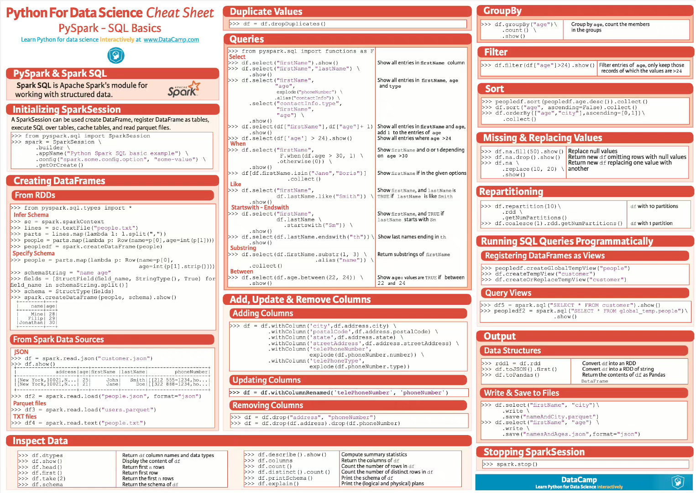

# pyspark

### 先附图


### Create RDD
```python
dataList = ["java good", "Python awsome", "Scala good"]
rdd = spark.sparkContext.parallelize(dataList, 3)
```

### getNumPartitions
 获取分区数量
```python
print("initial partition count:" + str(rdd.getNumPartitions()))
```

### Repartition and Coalesce
```python
reparRdd = rdd.repartition(4)
print("re-partition count:" + str(reparRdd.getNumPartitions()))
reparRdd2 = rdd.coalesce(2)
print("re-partition count:" + str(reparRdd2.getNumPartitions()))
```
 repartition（）方法是一个非常昂贵的操作，因为它会将集群中所有节点的数据混洗
 如果你在4个分区中有数据，那么执行coalesce（2）只从2个节点移动数据。coalesce()只能减少分区，不能增加分区
 总结：减少分区使用coalesce，增加分区使用repartition

## RDD Transformations算子

### flatMap
```python
rdd2 = rdd.flatMap(lambda x: x.split(" "))
```

### Map
```python
rdd3 = rdd2.map(lambda x: (x, 1))
```

### reduceByKey
```python
rdd4 = rdd3.reduceByKey(lambda a, b: a + b)
```

### sortByKey
```python
rdd5 = rdd4.map(lambda x: (x[1], x[0])).sortByKey()
```

### filter
```python
rdd6 = rdd5.filter(lambda x: 'Python' in x[1])
```

## RDD Actions算子

### count
```python
print("Count : " + str(rdd6.count()))
```

### first
```python
firstRec = rdd6.first()
print("First Record : " + str(firstRec[0]) + "," + firstRec[1])
```

### max
```python
datMax = rdd6.max()
print("Max Record : " + str(datMax[0]) + "," + datMax[1])
```

### reduce
```python
totalWordCount = rdd5.reduce(lambda a, b: (a[0] + b[0], a[1]))
print("dataReduce Record : " + str(totalWordCount))
```

### take
```python
data3 = rdd5.take(3)
for f in data3:
    print("data3 Key:" + str(f[0]) + ", Value:" + f[1])
```

## Advantages of Persisting RDD

### Cache
```python
cachedRdd = rdd.cache()
# 默认Cache storage level `MEMORY_ONLY`
# 可选RDD Persist MEMORY_ONLY,MEMORY_AND_DISK, MEMORY_ONLY_SER, MEMORY_AND_DISK_SER, DISK_ONLY, MEMORY_ONLY_2,MEMORY_AND_DISK_2 and more.
# 指定不同的存储级别
dfPersist = rdd.persist(pyspark.StorageLevel.MEMORY_ONLY)
# 释放RDD的持久性，从而释放占用的内存。
rddPersist2 = dfPersist.unpersist()
```

### Broadcast
   Broadcast 是一种用于将大数据结构广播到集群中的所有节点以供任务使用的机制。这对于避免网络传输和提高性能非常有用，尤其是当你需要在多个任务中使用相同的数据时，例如在 join 操作中。
 Broadcast 可以用于将只读的大数据结构（例如字典、集合、DataFrame 等）传播到各个节点，以避免将这些数据复制到每个任务的内存中。这可以减少网络传输和降低内存占用，从而提高性能。
```python
broadcastVar = spark.sparkContext.broadcast([0, 1, 2, 3])
print(broadcastVar.value)
```

### Accumulators
   用于在分布式计算中进行累积操作。Accumulator 通常用于在并行操作中累积结果，例如计数或总和，而不会引发竞争条件（race condition）。它们在多个任务中进行并行操作，然后将结果累积到单个变量中。
 主要的用法是在 Spark 作业中创建一个 Accumulator，然后在不同的任务中累积值。这些值可以被所有任务读取，但只能被累积，不能被修改。
```python
accumulator = spark.sparkContext.accumulator(0)
spark.sparkContext.parallelize([1, 2, 3]).foreach(lambda x: accumulator.add(x))
print(accumulator.value)
```