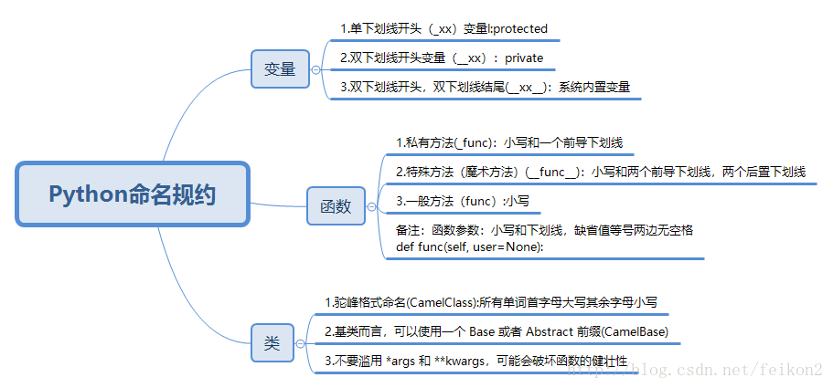

## python

##### 生成式（推导式）的用法

```python
prices = {
    'AAPL': 191.88,
    'GOOG': 1186.96,
    'IBM': 149.24,
    'ORCL': 48.44,
    'ACN': 166.89,
    'FB': 208.09,
    'SYMC': 21.29
}
# 用股票价格大于100元的股票构造一个新的字典
prices2 = {key: value for key, value in prices.items() if value > 100}
print(prices2)
```

##### 后台执行的方法

```shell
nohup python3 main.py >/dev/null 2>&1 &
nohup python3 main.py >./log/runtime_`date +%Y-%m-%d-%H-%M-%S`.out 2>&1 &
```

##### 命名规范


**文件名**

全小写,可使用下划线

**包**

应该是简短的、小写的名字。如果下划线可以改善可读性可以加入。如mypackage。

**模块**

与包的规范同。如mymodule。

**类**

总是使用首字母大写单词串。如MyClass。内部类可以使用额外的前导下划线。

**函数&方法**

函数名应该为小写，可以用下划线风格单词以增加可读性。如：myfunction，my_example_function。

*注意*：混合大小写仅被允许用于这种风格已经占据优势的时候，以便保持向后兼容。

函数和方法的参数

总使用“self”作为实例方法的第一个参数。总使用“cls”作为类方法的第一个参数。

如果一个函数的参数名称和保留的关键字冲突，通常使用一个后缀下划线好于使用缩写或奇怪的拼写。

**全局变量**

对于from M import *导入语句，如果想阻止导入模块内的全局变量可以使用旧有的规范，在全局变量上加一个前导的下划线。

*注意*:应避免使用全局变量

**变量**

变量名全部小写，由下划线连接各个单词。如color = WHITE，this_is_a_variable = 1

*注意*：

1.不论是类成员变量还是全局变量，均不使用 m 或 g 前缀。

2.私有类成员使用单一下划线前缀标识，多定义公开成员，少定义私有成员。

3.变量名不应带有类型信息，因为Python是动态类型语言。如 iValue、names_list、dict_obj 等都是不好的命名。

**常量**

常量名所有字母大写，由下划线连接各个单词如MAX_OVERFLOW，TOTAL。

**异常**

以“Error”作为后缀。

**缩写**

命名应当尽量使用全拼写的单词，缩写的情况有如下两种：

1.常用的缩写，如XML、ID等，在命名时也应只大写首字母，如XmlParser。

2.命名中含有长单词，对某个单词进行缩写。这时应使用约定成俗的缩写方式。

例如：

function 缩写为 fn

text 缩写为 txt

object 缩写为 obj

count 缩写为 cnt

number 缩写为 num，等。

**前导后缀下划线**

一个前导下划线：表示非公有。

一个后缀下划线：避免关键字冲突。

两个前导下划线：当命名一个类属性引起名称冲突时使用。

两个前导和后缀下划线：“魔”（有特殊用图）对象或者属性，例如__init__或者__file__。绝对不要创造这样的名字，而只是使用它们。

*注意*：关于下划线的使用存在一些争议。

**特定命名方式**

主要是指 __xxx__ 形式的系统保留字命名法。

项目中也可以使用这种命名，它的意义在于这种形式的变量是只读的，这种形式的类成员函数尽量不要重载。如

class Base(object):

def __init__(self, id, parent = None):

self.__id__ = id

self.__parent__ = parent

def __message__(self, msgid):

其中 __id__、__parent__ 和 __message__ 都采用了系统保留字命名法。

附:Google Python命名规范

module_name, package_name, ClassName, method_name, ExceptionName, function_name, GLOBAL_VAR_NAME, instance_var_name, function_parameter_name, local_var_name.


**字典的合并**

info_1 = {"apple": 13, "orange": 22}
info_2 = {"爆款写作": 48, "跃迁": 49}
##### 一行代码搞定合并两个字典
new_info = {**info_1, **info_2}
print(new_info)
输出：
{'apple': 13, 'orange': 22, '爆款写作': 48, '跃迁': 49}


##### Numpy

###### **1.1. 使用np.array创建数组**

```python
a = np.array([1,2,3,4])
#打印数组
print(a)
#查看类型
print(type(a))
```

###### **1.2. 使用np.arange创建数组**

```python
#创建0-10步数为2的数组 结果为[0,2,4,6,8]
#2. 使用np.arange创建数组
b = np.arange(0,10,2)
```

###### **1.3. np.random.random创建数组**

```python
#3. np.random.random创建一个N行N列的数组
# 其中里面的值是0-1之间的随机数
# 创建2行2列的数组
c = np.random.random((2,2))
```

###### **1.4. np.random.randint创建数组**

```python
#4. np.random.randint创建一个N行N列的数组
# 其中值的范围可以通过前面2个参数来指定
# 创建值的范围为[0,9)的4行4列数组
d = np.random.randint(0,9,size=(4,4))
```

###### **1.5. 特殊函数**

```python
#5. 特殊函数
#5.1 zeros
## N行N列的全零数组
### 例如：3行3列全零数组
array_zeros = np.zeros((3,3))
#5.2 ones
## N行N列的全一数组
### 例如：4行4列全一数组
array_ones = np.ones((4,4))
#5.3 full
## 全部为指定值的N行N列数组
### 例如：值为9的2行3列数组
array_full = np.full((2,3),9)
#5.4 eye
## 生成一个在斜方形上元素为1，其他元素都为0的N行N列矩阵
### 例如：4行4列矩阵
array_eye = np.eye(4)
```

###### **2.1 数据类型**

| 数据类型   | 描述                                                        | 唯一标识符 |
| :--------- | :---------------------------------------------------------- | :--------- |
| bool       | 用一个字节存储的布尔类型（True或False）                     | b          |
| int8       | 一个字节大小，-128 至 127                                   | i1         |
| int16      | 整数，16 位整数(-32768 ~ 32767)                             | i2         |
| int32      | 整数，32 位整数(-2147483648 ~ 2147483647)                   | i4         |
| int64      | 整数，64 位整数(-9223372036854775808 ~ 9223372036854775807) | i8         |
| uint8      | 无符号整数，0 至 255                                        | u1         |
| uint16     | 无符号整数，0 至 65535                                      | u2         |
| uint32     | 无符号整数，0 至 2 ** 32 - 1                                | u4         |
| uint64     | 无符号整数，0 至 2 ** 64 - 1                                | u8         |
| float16    | 半精度浮点数：16位，正负号1位，指数5位，精度10位            | f2         |
| float32    | 单精度浮点数：32位，正负号1位，指数8位，精度23位            | f4         |
| float64    | 单精度浮点数：64位，正负号1位，指数11位，精度52位           | f8         |
| complex64  | 复数，分别用两个32位浮点数表示实部和虚部                    | c8         |
| complex128 | 复数，分别用两个64位浮点数表示实部和虚部                    | c16        |
| object_    | python对象                                                  | O          |
| string_    | 字符串                                                      | S          |
| unicode_   | unicode类型                                                 | U          |

###### **2.2 创建数组指定数据类型**

```python
import numpy as np
a = np.array([1,2,3,4,5],dtype='i1')
a = np.array([1,2,3,4,5],dtype=int32)
```

###### **2.3 查询数据类型**

```python
class Person:
    def __init__(self,name,age):
        self.name = name
        self.age = age
d = np.array([Person('test1',18),Person('test2',20)])
print(d)
print(d.dtype)
```

###### **2.4 修改数据类型**

```python
f = a.astype('f2')
```

###### **3.1 数组维度查询**

```python
import numpy as np
# 数组维度
## 维度为1
a1 = np.array([1,2,3])
print(a1.ndim)
## 维度为2
a2 = np.array([[1,2,3],[4,5,6]])
print(a2.ndim)
## 维度为3
a3 = np.array([
    [
        [1,2,3],
        [4,5,6]
    ],
    [
        [7,8,9],
        [10,11,12]
    ]
])
print(a3.ndim)
```

###### **3.2 数组形状查询**

```python
a1 = np.array([1,2,3])
# 结果为(3,)
print(a1.shape)
a2 = np.array([[1,2,3],[4,5,6]])
# 结果为(2,3)
print(a2.shape)
a3 = np.array([
    [
        [1,2,3],
        [4,5,6]
    ],
    [
        [7,8,9],
        [10,11,12]
    ]
])
# 结果为(2,2,3)
print(a3.shape)
```

###### **3.3 修改数组形状**

```python
a1 = np.array([
    [
        [1,2,3],
        [4,5,6]
    ],
    [
        [7,8,9],
        [10,11,12]
    ]
])
a2 = a1.reshape((2,6))
print(a2)
#结果为(2, 6)
print(a2.shape)
# 扁平化 （多维数组转化为一维数组）
a3 = a2.flatten()
print(a3)
print(a3.ndim)
```

###### **3.4 数组元素个数与所占内存**

```python
a1 = np.array([
    [
        [1,2,3],
        [4,5,6]
    ],
    [
        [7,8,9],
        [10,11,12]
    ]
])
#数组的元素个数
count = a1.size
print(count)
#各元素所占内存
print(a1.itemsize)
#各元素数据类型
print(a1.dtype)
#数组所占内存
print(a1.itemsize * a1.size)
```

###### **3.5 总结**

```python
（1）一般情况下，数组维度最大到三维，一般会把三维以上的数组转化为二维数组来计算
（2）ndarray.ndmin查询数组的维度
（3）ndarray.shape可以看到数组的形状（几行几列），shape是一个元组，里面有几个元素代表是几维数组
（4）ndarray.reshape可以修改数组的形状。条件只有一个，就是修改后的形状的元素个数必须和原来的个数一致。比如原来是（2,6），那么修改完成后可以变成（3,4），但是不能变成（1,4）。reshape不会修改原来数组的形状，只会将修改后的结果返回。
（5）ndarray.size查询数组元素个数
（6）ndarray.itemsize可以看到数组中每个元素所占内存的大小，单位是字节。（1个字节=8位）
```

###### **4.2 二维数组**

```python
# 2. 多维数组
# 通过中括号来索引和切片，在中括号中使用逗号进行分割
#逗号前面的是行，逗号后面的是列，如果多维数组中只有一个值，那么这个值就是行
a2 = np.random.randint(0,10,size=(4,6))
print(a2)
#获取第0行数据
print(a2[0])
#获取第1,2行数据
print(a2[1:3])
#获取多行数据 例0,2,3行数据
print(a2[[0,2,3]])
#获取第二行第一列数据
print(a2[2,1])
#获取多个数据 例:第一行第四列、第二行第五列数据
print(a2[[1,2],[4,5]])
#获取多个数据 例:第一、二行的第四、五列的数据
print(a2[1:3,4:6])
#获取某一列数据 例:第一列的全部数据
print(a2[:,1])
#获取多列数据 例:第一、三列的全部数据
print(a2[:,[1,3]])
```

### conda环境搭建

```
# 下载
wget https://repo.anaconda.com/archive/Anaconda3-2023.03-1-Linux-x86_64.sh

1、输入命令：bash Anaconda-3-5.3.1-Linux-x86_64.sh
2、回车
3、输入：yes
4、选择安装路径，可以修改安装路径
5、输入：yes
# 提示“Thank you for installing Anaconda3!”视为安装成功

# 文件配置

1、打开配置文件：
    vim /etc/profile
2、 在文件的最后加上如下配置
    export ANACONDA_HOME=xxx/anaconda3           # 步骤2.4 中的安装路径
    export PATH=$ANACONDA_HOME/bin:$PATH
    export PYSPARK_PYTHON=$ANACONDA_HOME/bin/python            # 可不添加
3、source /etc/profile     # 使文件修改生效

#添加数据源：例如, 添加清华anaconda镜像：
conda config --add channels https://mirrors.aliyun.com/conda/pkgs/free/
conda config --add channels https://mirrors.aliyun.com/conda/pkgs/main/
conda config --add channels https://mirrors.aliyun.com/conda/pkgs/r/

```

##### 命令

```
1. conda --version #查看conda版本，验证是否安装
2. conda update conda #更新至最新版本，也会更新其它相关包
conda update -n base conda #update最新版本的conda
3. conda update --all #更新所有包
4. conda update package_name #更新指定的包
5. conda create -n env_name package_name #创建名为env_name的新环境，并在该环境下安装名为package_name 的包，可以指定新环境的版本号，例如：conda create -n python2 python=python2.7 numpy pandas，创建了python2环境，python版本为2.7，同时还安装了numpy pandas包
6. conda activate env_name #切换至env_name环境
7. conda deactivate #退出环境
8. conda info -e #显示所有已经创建的环境
或 conda env list
或 conda info --envs
9. conda create --name new_env_name --clone old_env_name #复制old_env_name为new_env_name
10. conda remove --name env_name –all #删除环境
11. conda list # 查看所有已经安装的包
12. conda install package_name #在当前环境中安装包
13. conda install --name env_name package_name #在指定环境中安装包
14. conda remove -- name env_name package #删除指定环境中的包
15. conda remove package #删除当前环境中的包
16. conda env remove -n env_name #采用第10条的方法删除环境失败时，可采用这种方法


17. 以下两个命令必须在 base 环境下进行操作，否则会报错
conda create --name newname --clone oldname      # 克隆oldname 环境为newname 环境
conda remove --name oldname --all       # 彻底删除旧环境
```

**conda 自动开启/关闭激活**

```
conda config --set auto_activate_base false  #关闭自动激活状态
conda config --set auto_activate_base true  #关闭自动激活状态
```

**conda瘦身**

```
 conda clean 可以轻松搞定
conda clean -p        # 删除没有用的包
conda clean -r        # 删除 tar 包
conda clean -y --all    # 删除所有的安装包及cache
```


**如何使用回服务器的python**

```
vi /etc/profile
把export PATH=$ANACONDA_HOME/bin:$PATH
修改为：
export PATH=$PATH:$ANACONDA_HOME/bin
source /etc/profile

vi ~/.bashrc
修改PATH为export PATH="$PATH:/home/data/anaconda3/bin"
source ~/.bashrc

查看：
echo $PATH
WHICH python3