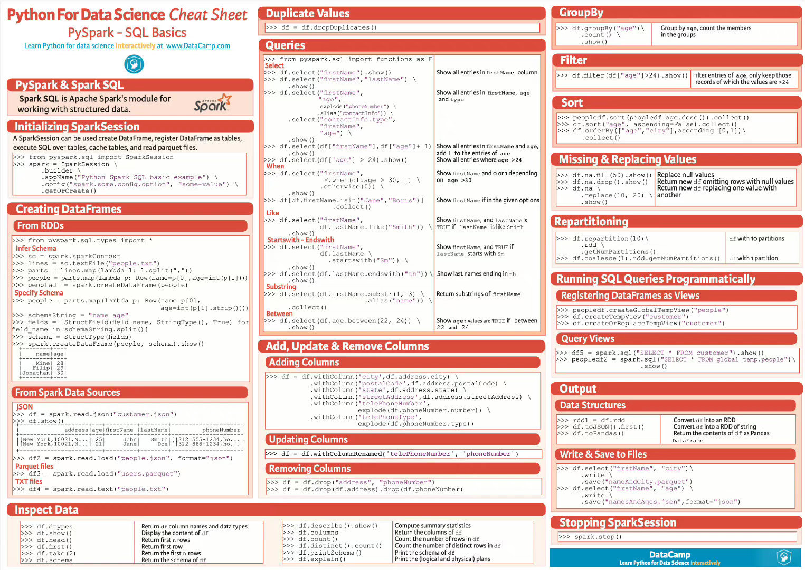

# spark


## pyspark-sql:


## spark命令
| 参数            | 示例                                                         |     | 描述                                                         |
|:----------------| :----------------------------------------------------------- |-----| :----------------------------------------------------------- |
| class           | org.apache.spark.examples.SparkPi                            |     | 作业的主类。                                                 |
| master          | yarn                                                         |     | 使用Yarn模式。                                               |
| yarn-client     | 等同于–-master yarn —deploy-mode client， 此时不需要指定deploy-mode。 |     |                                                              |
| yarn-cluster    | 等同于–-master yarn —deploy-mode cluster， 此时不需要指定deploy-mode。 |     |                                                              |
| deploy-mode     | client                                                       |     | client模式表示作业的AM会放在Master节点上运行。如果设置此参数，需要指定Master为yarn。 |
| cluster         | cluster模式表示AM会随机的在Worker节点中的任意一台上启动运行。如果设置此参数，需要指定Master为yarn。 |     |                                                              |
| driver-memory   | 4g                                                           |     | Driver使用的内存，不可超过单机的总内存。                     |
| num-executors   | 2                                                            |     | 创建Executor的个数。                                         |
| executor-memory | 2g                                                           |     | 各个Executor使用的最大内存，不可以超过单机的最大可使用内存。 |
| executor-cores  | 2                                                            |     | 各个Executor使用的并发线程数目，即每个Executor最大可并发执行的Task数目。 |


```
# SPARK ON YARN的两种启动方法
# YARN client:
./bin/spark-submit \
  --class org.apache.spark.examples.SparkPi \
  --master yarn \
  --deploy-mode client \ 
  --executor-memory 4G \
  --executor-cores 2 \
  --num-executors 3 \
  --conf spark.default.parallelism=2*3*2 \
  --conf spark.sql.shuffle.partitions=2*3*2 \
  ./examples/jars/spark-examples_2.12-3.2.1.jar

# 动态资源方式
./bin/spark-submit \
  --class org.apache.spark.examples.SparkPi \
  --master yarn \
  --deploy-mode client \ 
  --conf spark.shuffle.service.enabled=true \
  --conf spark.dynamicAllocation.enabled=true  \
  ./examples/jars/spark-examples_2.12-3.2.1.jar  

# YARN cluster:
./bin/spark-submit --class org.apache.spark.examples.SparkPi \
    --master yarn \
     --conf spark.yarn.appMasterEnv.LANG=zh_CN.UTF-8 \
    --deploy-mode cluster \
    --driver-memory 4g \
    --executor-memory 2g \
    --executor-cores 1 \
    --queue thequeue \
    lib/spark-examples*.jar \
    
./bin/spark-submit --class org.apache.spark.examples.SparkPi \
    --master yarn \
    --deploy-mode cluster \
    --conf spark.shuffle.service.enabled=true \
    --conf spark.dynamicAllocation.enabled=true  \
    lib/spark-examples*.jar \    

# spark集成Hudi
./spark-submit 
    --master yarn \
    --deploy-mode cluster \ 
    --packages org.apache.hudi:hudi-spark3.2-bundle_2.12:0.11.1 \
    --conf 'spark.serializer=org.apache.spark.serializer.KryoSerializer' \
    --conf 'spark.sql.catalog.spark_catalog=org.apache.spark.sql.hudi.catalog.HoodieCatalog' \
    --conf 'spark.sql.extensions=org.apache.spark.sql.hudi.HoodieSparkSessionExtension'
    --conf spark.shuffle.service.enabled=true \
    --conf spark.dynamicAllocation.enabled=true  \
# spark提交大型python任务,需要打包成zip 指定主方法
# 注意，打包的时候一定要进入根目录打包，打完包点进去直接到模块的目录，不能再有一层目录；
./spark-submit 
--master yarn \
--deploy-mode client \
--conf spark.yarn.executor.memoryOverhead=10G \
--conf spark.shuffle.service.enabled=true \
--conf spark.dynamicAllocation.enabled=true  \
--conf spark.sql.shuffle.partitions=1000 \
--conf spark.dynamicAllocation.enabled=false \
--py-files dmp.zip  main.py arg1 arg2


# spark sql on yarn
./spark-sql \
--master yarn \
--conf spark.shuffle.service.enabled=true \
--conf spark.dynamicAllocation.enabled=true 

# spark sql on yarn ,delta lake
./spark-sql \
--master yarn \
--conf spark.shuffle.service.enabled=true \
--conf spark.dynamicAllocation.enabled=true  \
--packages io.delta:delta-core_2.12:2.0.0rc1 \
--conf "spark.sql.espark.sql.extensions=io.delta.sql.DeltaSparkSessionExtension" \
--conf "spark.sql.catalog.spark_catalog=org.apache.spark.sql.delta.catalog.DeltaCatalog"


# spark sql on yarn，hudi
./spark-sql \
--master yarn \
--packages org.apache.hudi:hudi-spark3.2-bundle_2.12:0.11.1 \
--conf 'spark.serializer=org.apache.spark.serializer.KryoSerializer' \
--conf 'spark.sql.extensions=org.apache.spark.sql.hudi.HoodieSparkSessionExtension' \
--conf 'spark.sql.catalog.spark_catalog=org.apache.spark.sql.hudi.catalog.HoodieCatalog' \
--conf spark.shuffle.service.enabled=true \
--conf spark.dynamicAllocation.enabled=true \
--executor-memory 1G \
--executor-cores 1 \
--num-executors 2 \

# spark submit on yarn，delta
./spark-submit \
--master yarn \
--deploy-mode client \
--packages io.delta:delta-core_2.12:2.0.0rc1 \
--conf "spark.sql.espark.sql.extensions=io.delta.sql.DeltaSparkSessionExtension" \
--conf "spark.sql.catalog.spark_catalog=org.apache.spark.sql.delta.catalog.DeltaCatalog" \
--conf spark.shuffle.service.enabled=true \
--conf spark.dynamicAllocation.enabled=true \
--executor-memory 3G \
--executor-cores 2 \
--num-executors 6 \
../job/read_hudi.py

# spark submit on yarn，hudi
./spark-submit \
--master yarn \
--deploy-mode client \
--packages org.apache.hudi:hudi-spark3.2-bundle_2.12:0.11.1 \
--conf 'spark.serializer=org.apache.spark.serializer.KryoSerializer' \
--conf 'spark.sql.extensions=org.apache.spark.sql.hudi.HoodieSparkSessionExtension' \
--conf 'spark.sql.catalog.spark_catalog=org.apache.spark.sql.hudi.catalog.HoodieCatalog' \
--conf spark.shuffle.service.enabled=true \
--conf spark.dynamicAllocation.enabled=true \
--executor-memory 4G \
--executor-cores 2 \
--num-executors 8 \
../job/hudi_pg_kx_order.py


注意，这里的–master必须使用yarn-client模式，若是指定yarn-cluster，则会报错：apache
Error: Cluster deploy mode is not applicable to Spark shells.api
由于spark-shell/spark-sql做为一个与用户交互的命令行，必须将Driver运行在本地，而不是yarn上。

配置建议
如果将内存设置的很大，要注意GC所产生的消耗。通常推荐每一个Executor的内存<=64 GB。
如果是进行HDFS读写的作业，建议每个Executor中使用<=5个并发来读写。
如果是进行Obs读写的作业，建议是将Executor分布在不同的ECS上，这样可以将每一个ECS的带宽都用上。例如，有10台ECS，那么就可以配置num-executors=10，并设置合理的内存和并发。
如果作业中使用了非线程安全的代码，则在设置executor-cores的时候需要注意多并发是否会造成作业的不正常。如果会造成作业不正常，推荐设置executor-cores=1。
提交参数资源如何分配可参考：https://www.alibabacloud.com/help/zh/e-mapreduce/latest/configure-spark-submit-parameters

适用场景
Delta适用于云上数据湖数据管理解决方案。如果您存在以下场景，可以使用Delta：
实时查询：数据实时从上游流入Delta，查询侧即可查询该数据，例如，在CDC场景下，Spark Streaming实时消费binlog时，使用Delta merge功能，实时将上游的数据通过merge更新到Delta Lake，然后可以使用Hive、Spark或Presto实时查询。同时，由于支持ACID，保证了数据的流入和查询的隔离性，不会产生脏读数据。
删除或更新，GDPR（General Data Protection Regulation）：通常数据湖方案不支持数据的删除或更新。如果需要删除或更新数据，则需要把原始数据清理掉，然后把更新后的数据写入存储。而Delta支持数据的删除或更新。
数据实时同步，CDC（Change Data Capture）：使用Delta merge功能，启动流作业，实时将上游的数据通过merge更新到Delta Lake。
数据质量控制：借助于Delta Schema校验功能，在数据导入时剔除异常数据，或者对异常数据做进一步处理。
数据演化：数据的Schema并非固定不变，Delta支持通过API 方式改变数据的Schema。
实时机器学习：在机器学习场景中，通常需要花费大量的时间用于处理数据，例如数据清洗、转换、提取特征等等。同时，您还需要对历史和实时数据分别处理。而Delta简化了工作流程，整条数据处理过程是一条完整的、可靠的实时流，其数据的清洗、转换、特征化等操作都是流上的节点动作，无需对历史和实时数据分别处理。
```
### Hints
```
SELECT /*+ COALESCE(3) */ * FROM t;

SELECT /*+ REPARTITION(3) */ * FROM t;

SELECT /*+ REPARTITION(c) */ * FROM t;

SELECT /*+ REPARTITION(3, c) */ * FROM t;

SELECT /*+ REPARTITION_BY_RANGE(c) */ * FROM t;

SELECT /*+ REPARTITION_BY_RANGE(3, c) */ * FROM t;

SELECT /*+ REBALANCE */ * FROM t;

SELECT /*+ REBALANCE(3) */ * FROM t;

SELECT /*+ REBALANCE(c) */ * FROM t;

SELECT /*+ REBALANCE(3, c) */ * FROM t; 
```